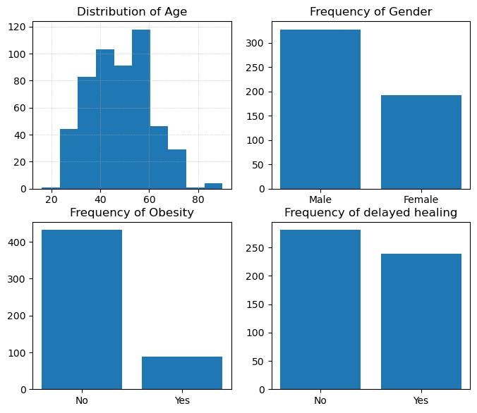

# Diabetes-risk-prediction

Diabetes is one of the fastest growing chronic life threatening diseases that have already affected 422 million people worldwide according to the report of World Health Organization (WHO), 
in 2018.

To predict the likelihood of having diabetes requires a dataset, which contains the data of patients who are at risk of diabetes and not at risk. 
We will utilise a dataset obtained from the UCI machine learning repository which contains 520 instances collected using direct quastionnaires from the patients of Sylhet Diabetes Hospital in Bangladesh. 
https://doi.org/10.1007/978-981-13-8798-2_12

Here is an updated README with some sample Markdown formatting for images and links:

# Diabetes Prediction Model 

## Overview
This project involved developing a machine learning model to predict the likelihood of a patient having diabetes based on diagnostic measures.
We will utilise a dataset obtained from the UCI machine learning repository which contains 520 instances collected using direct quastionnaires from the patients of Sylhet Diabetes Hospital in Bangladesh. 
[source](https://doi.org/10.1007/978-981-13-8798-2_12).

## Data Cleaning and EDA
The raw data was first loaded and inspected. The data appeared to be quite processed and hence there was really no cleaning to be done.
The distributions of the features were visualized through histograms and bar charts.

We also carried out one-hot encoding of the categorical variables to allow machine learning algorithms to operate effectively and capture non-linear relationships in the data.

## Model Development 
The data was split into training and test sets with a 70/30 ratio. Two models were trained - a Random Forest classifier and an SVM. Performance was evaluated on the test set using accuracy, precision, recall and confusion matrix. 
The Random Forest model achieved the best results with an accuracy of 95% and was selected.

## Model Saving
The trained Random Forest model was pickled and saved to `model.pkl` to persist it for future use. 

## Web Application
A web application was built using Streamlit to allow real-time predictions using the saved Random Forest model. 
Users can input values for the features and receive a prediction on diabetes likelihood. The application is deployed at [check it out](https://diabetes-risk-prediction.streamlit.app/).

## Repository Contents
- Data pre-processing, Model training and evaluation notebook
- Saved pre-process file for new data
- Saved Random Forest model file
- Web application code
- Images of the app
- Requirements.txt with app dependencies  
- This README

## Future Improvements
- Try other models like XGBoost or neural networks
- Hyperparameter tuning for optimal model performance 
- Collect additional data to retrain models
- Add more features to web app like model interpretation
